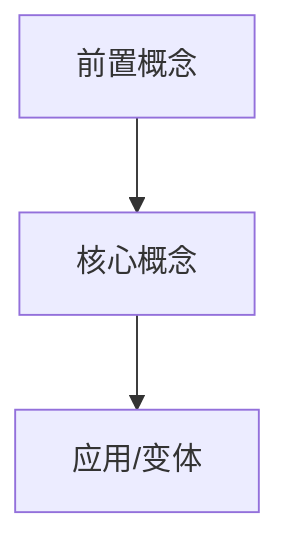

# 苏格拉底概念学习工作流

## 目标

把一本教材、一篇论文、一组笔记或一个知识主题，转成「总体架构 + 概念地图 + 双路径学习」的交互式学习过程。

这个 skill 适合用户已经有一部分背景知识，想快速查漏补缺；也适合用户希望用苏格拉底式问题一步步推导概念。核心不是复述教材，而是帮用户看见：这个领域有哪些概念、它们为什么存在、分别解决了什么问题，以及自己在哪些节点上还没有打通。

学习过程要尽量让用户主动回忆和预测。直接解释负责建立地图，提问负责暴露理解缺口，日志负责把缺口带到下一次复习。

本 skill 属于学习系列的 **Learning Skill**。涉及概念卡片、关系类型、问题类型、学习路径和 `book_model.json` 时，对齐 [`reference_learning_knowledge_model.md`](./reference_learning_knowledge_model.md)。如果用户已经进入某个学习单元的练习反馈或掌握状态更新，对齐 [`reference_learning_feedback.md`](./reference_learning_feedback.md)。学习单元可以按章节、单元、概念、主题或用户自定义范围切分。如果用户要求把学习材料做成可交互 HTML，再叠加 [`workflow_interactive_book_deconstruction.md`](./workflow_interactive_book_deconstruction.md)。

## 触发场景

当用户表达以下意图时使用：

- 想学一门课、一本书、一篇论文、一个技术主题
- 想要「总体架构」「概念地图」「知识地图」「查漏补缺」
- 想让 AI 像老师一样提问、引导、追问
- 想理解某个概念为什么被提出、解决什么问题
- 想把教材、电子书、课程资料变成可交互学习系统
- 刚学完某一章、单元、概念或主题，想检查概念、有效性和现实应用

如果用户只问一个孤立概念，可以轻量使用本 skill 的「概念卡片」格式；如果用户给的是一整本书或课程，使用完整工作流。

## 基本判断

严格的苏格拉底式教学对初学者有用，但对已经有部分概念的学习者效率偏低。默认采用「半苏格拉底」：先给地图和关键概念，让用户知道自己站在哪里；再用问题检查理解，而不是把所有知识都藏在问题后面。

学习有两条路径：

1. **直接概念路径**：先给总体架构、概念地图、关键定义、概念之间的依赖关系。
2. **问题引导路径**：围绕一个概念，从问题场景出发，让用户先尝试解释，再补充定义、机制和边界。

用户没有明确选择时，默认先走直接概念路径，因为这更适合查漏补缺。每个概念后面都保留 1-3 个问题，用来确认理解。

## 学习产物

长期学习任务应当落盘到 `contexts/learning_sessions/<topic>/`。如果只是一次性回答，可以直接在对话中输出，不必创建文件。

推荐文件结构：

```text
contexts/learning_sessions/<topic>/
├── README.md                # 学习目标、资料来源、当前进度
├── learning_map.md          # 总体架构和概念地图
├── concept_cards/           # 原子概念卡片
├── unit_map.md              # 学习单元到核心问题、概念和练习的映射
├── question_bank.md         # 诊断题、迁移题、反例题
├── practice_log.md          # 练习回答和反馈记录
├── feedback_state.md        # 已掌握、半掌握、待补齐状态
├── session_log.md           # 每次学习记录
├── learner_profile.md       # 用户已知、薄弱点、偏好
└── source_index.md          # 教材/论文/资料对应学习单元
```

不需要每次都创建全部文件。总览学习的最小可用版本是 `learning_map.md` + `concept_cards/` + `session_log.md`。学习单元反馈的最小可用版本是 `learning_map.md` + `unit_map.md` + `practice_log.md` + `feedback_state.md`。

## 输出规格

### 1. 总体架构

先给用户一个「领域是怎么组织起来的」视图，而不是直接进入细节。

使用这个结构：

````markdown
# [主题] 学习地图

## 一句话总览
[这个领域/学习单元到底在处理什么核心问题]

## 总体架构
- [模块 A]：[它负责解决的问题]
- [模块 B]：[它负责解决的问题]
- [模块 C]：[它负责解决的问题]

## 概念依赖


## 学习路线
1. [先学什么，为什么]
2. [再学什么，为什么]
3. [最后学什么，为什么]

## 查漏补缺入口
- 如果你已经懂 [X]，直接看 [Y]
- 如果你卡在 [A]，先补 [B]
- 如果你只想应用，优先掌握 [C]
````

Mermaid 只在关系复杂时使用。概念少于 6 个时，用普通列表更清楚。

### 2. 原子概念卡片

每个概念单独成卡。不要把多个概念塞进一张卡。

```markdown
# [概念名]

## 一句话定义
[用一句话说清楚它是什么]

## 为什么需要它
[没有这个概念时，会遇到什么问题]

## 它解决了什么问题
[它引入后，具体让什么事变得可表达、可计算、可控制或可复用]

## 机制
[它怎么工作，关键步骤或关键关系是什么]

## 边界
- 它不能解决什么
- 它常被误解成什么
- 它和相邻概念的区别

## 例子
[一个最小例子，优先使用用户熟悉的领域]

## 检查问题
1. [定义检查]
2. [为什么需要它]
3. [迁移应用或反例]

## 相关概念
- [[概念 A]]
- [[概念 B]]
```

「为什么需要它」是这张卡的关键。不要只给定义。用户真正要补的是概念出现的动机。

### 3. 一轮教学回复

一轮交互尽量保持短，但必须有方向感。

```markdown
## 当前位置
[现在在概念地图中的哪个节点]

## 直接解释
[如果用户选择直接概念路径，先给清晰解释]

## 为什么要有这个概念
[问题场景 → 旧方法失败 → 新概念出现]

## 追问
[1-2 个问题，让用户暴露理解缺口]

## 下一步
- 继续问我这个概念
- 切到相邻概念：[X]
- 做一道迁移题
```

如果用户已经明确选择「苏格拉底模式」，先问问题；如果用户回答卡住，再给提示阶梯：轻提示 → 中提示 → 直接解释。

### 4. 学习单元反馈回复

用户说「我读完第 N 章了」「复盘这个单元」「检查这个概念」「围绕这个主题给我练习」时，切到学习单元反馈路径，并使用 [`reference_learning_feedback.md`](./reference_learning_feedback.md)。

```markdown
## 范围定位
[这个学习单元的范围、切分方式，以及它在整体材料或概念地图里的作用]

## 核心概念
- [概念 A]：[一句话定义]
- [概念 B]：[一句话定义]
- [概念 C]：[一句话定义]

## 为什么有效
[解释这些概念依赖的机制和边界]

## 如何应用
- [现实动作 1]
- [现实动作 2]
- [现实动作 3]

## 练习
1. [定义题]
2. [机制题]
3. [应用题]

## 反馈标准
[好答案要包含什么，常见误区是什么]
```

用户回答练习后，按反馈 reference 生成反馈：先保留有效部分，再定位缺口，给修正版，只追问一个问题，并更新已掌握、半掌握、待补齐状态。

## 提问设计

问题不是为了制造互动，而是为了定位理解缺口。每个问题背后都要有明确目的。

常用问题类型：

- **定位问题**：检查用户现在知道什么。例：你觉得进程和线程最大的差别在哪里？
- **动机问题**：逼出概念需求。例：如果 CPU 只有一个，但程序看起来同时运行，系统需要解决什么矛盾？
- **机制问题**：检查内部过程。例：一次上下文切换至少要保存哪些状态？
- **边界问题**：防止概念泛化过度。例：线程共享地址空间带来了什么方便，也带来了什么风险？
- **反例问题**：检查定义是否稳固。例：如果两个任务交替执行但不共享内存，它们更像线程还是进程？
- **迁移问题**：把概念用到新场景。例：把浏览器多标签页设计成多进程有什么收益和代价？

一次最多问 1-3 个问题。用户回答后，先判断回答中的有效部分，再指出缺口。不要直接把用户答案推倒重来。

学习单元反馈里，每个学习单元默认使用三题组合：定义题、机制题、应用题。概念型单元可以只问 1-2 题；用户表现稳定后再增加反例题或复盘题。

## 双路径切换规则

### 直接概念路径

用户说「先给我概念」「我想查漏补缺」「给我架构」「不用一步步问」时，直接输出概念地图和概念卡片。

要求：

- 先给总体地图，再讲局部概念
- 每个概念都讲「定义 + 动机 + 解决的问题」
- 每段解释后给少量检查问题
- 避免从教材第一页线性推进

### 问题引导路径

用户说「带我推导」「苏格拉底式」「先别告诉我答案」时，进入问题引导。

要求：

- 先给一个具体问题场景
- 等用户尝试回答后再推进
- 卡住时提供提示阶梯，不要一次性揭底
- 每完成一个概念，补一张概念卡式总结

### 混合路径

用户回答质量不稳定时，用混合路径：

1. 先给 3-5 行微讲解
2. 问一个定位问题
3. 根据回答决定继续追问还是直接补概念

这是默认模式，尤其适合有基础但不系统的学习者。

## 教材锚定

有教材、论文、电子书或代码资料时，学习必须锚定材料。

输出中尽量标明来源：

```markdown
来源：第 3 章「进程」
对应材料：`sources/os_concepts/ch03.md`
```

如果没有材料，明确说明当前解释是通用知识，而不是来自指定教材。涉及公式、定理、法律、医学、金融产品等高风险知识时，优先回到原始资料或官方来源，不要凭记忆编。

## 记忆与进度

长期学习时维护三类状态：

- **已掌握**：用户能稳定解释、应用、举反例的概念
- **半掌握**：用户知道术语，但动机、边界或机制不稳
- **待补齐**：用户明显缺失或混淆的前置概念

`session_log.md` 记录每次学习：

```markdown
## 2026-06-22 Session 1

### 学了什么
- [概念 A]
- [概念 B]

### 暴露的缺口
- [用户把 X 和 Y 混了]

### 下次优先
- [先复习 A，再进入 C]
```

`learner_profile.md` 只记录会影响后续教学的稳定偏好和长期薄弱点。不要把每次对话细节都塞进去。

学习单元反馈时，额外维护：

- `unit_map.md`：每个学习单元的核心问题、核心概念和练习状态。
- `practice_log.md`：题目、用户原始回答、反馈和下一步。
- `feedback_state.md`：已掌握、半掌握、待补齐概念。

这些文件的字段和模板对齐 [`reference_learning_feedback.md`](./reference_learning_feedback.md)。

## 可选陪伴层

如果用户明确想要更强的陪伴感，可以加入虚拟老师、学习小队或故事背景。默认不启用。

陪伴层只能服务学习：

- 角色语气可以有差异，但不能抢占知识内容
- 情绪反馈应当强化学习行为，而不是引导用户偏离主题
- 不使用恋爱养成、暧昧奖励或数值化好感度
- 学习进度、错题和复盘比角色剧情优先

推荐的轻量版本是「一位严格老师 + 一位耐心老师 + 一位提问型同伴」。角色之间可以分工，但每轮回复只让一个主讲，避免消耗上下文。

## 验收标准

一次完整学习输出算合格，需要满足：

- 用户能看到总体架构，而不是只得到线性讲解
- 每个核心概念都有「定义、为什么需要、解决什么问题」
- 概念之间有依赖关系或相邻关系
- 至少包含一组检查问题，用来定位理解缺口
- 学习单元反馈时，每个学习单元包含概念、有效性机制、现实应用和反馈标准
- 如果有来源材料，输出能追溯到学习单元或文件
- 长期学习任务有进度记录和下次优先事项

不合格表现：

- 只复述教材段落，没有概念地图
- 只连续提问，不给任何结构或解释
- 只给定义，不解释概念动机
- 角色扮演内容比知识内容更长
- 每轮问太多问题，用户不知道先答哪个

## 测试提示词

可用以下提示词检查 skill 是否生效：

1. `我想补操作系统，已经知道进程线程这些词，但不系统。先给我一个总体架构和概念地图，然后问我几个问题看我哪里缺。`
2. `带我用苏格拉底方式理解虚拟内存，先别直接讲完整答案，但我卡住时你要给提示。`
3. `我在读一本机器学习教材，帮我把“正则化”做成概念卡：定义、为什么需要、解决什么问题、常见误解、检查问题。`
